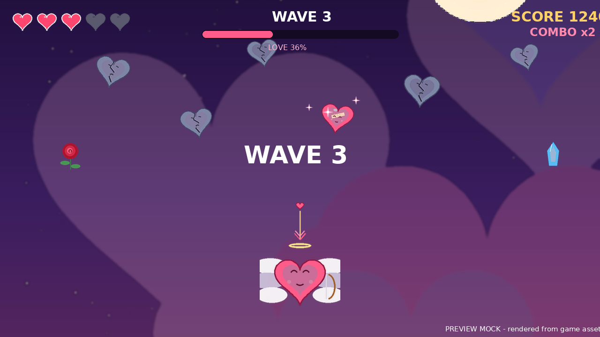

# Love-game ❤️ — Love Quest

> **A complete, CI-ready Unity 6 project.** You are Cupid — broken hearts are falling from the night sky. Shoot love arrows to mend them, build combos, catch roses and ice crystals, and survive 10 waves to win the night.


*Preview mock rendered from the actual game sprites.*

---

## What you get

| Piece | Detail |
|---|---|
| **Game** | 2D arcade romance: 10 waves, combo scoring (up to x4), 3–5 lives, rose heal + slow-mo crystal power-ups, procedural music & SFX (zero audio files), hand-drawn procedural sprites |
| **Engine** | Unity **6000.0.83f1** (Unity 6 LTS), built-in render pipeline, legacy Input, uGUI — no external packages beyond `com.unity.ugui` |
| **Architecture** | Self-bootstrapping scenes: each scene contains a camera + one `Boot` object; all UI/gameplay is constructed in code (nothing can corrupt in scene files) |
| **CI/CD** | GameCI workflow: license-activated WebGL build → compressed artifact (7-day retention, ~10–20 MB) → optional GitHub Pages deploy |
| **Assets** | ~300 KB of procedurally generated PNG sprites, all committed to git (no LFS needed) |

## Quick start — play locally

1. Install **[Unity Hub](https://unity.com/download)** (free).
2. In Unity Hub → *Installs* → *Install Editor* → pick **6000.0.83f1** (any recent Unity 6 LTS is fine, 6000.0.x).
3. Clone this repo and in Unity Hub → *Add* → *Add project from disk* → select the `Love-game` folder.
4. Wait for the first import (Unity generates `Library/`, ~1–2 minutes), then press **Play**.

> Full walkthrough with troubleshooting: **[docs/UNITY_SETUP.md](docs/UNITY_SETUP.md)** (includes a Hinglish quick-start).

## Quick start — build in the cloud (GitHub Actions + GameCI)

1. Install **[Unity Hub](https://unity.com/download)** and create a free Unity account.
2. Unity Hub → **Preferences → Licenses → Add → Get a free personal license** — this writes a `Unity_lic.ulf` file to your disk (Windows: `C:\ProgramData\Unity\`, macOS: `/Library/Application Support/Unity/`, Linux: `~/.local/share/unity3d/Unity/`).
3. In this repo: **Settings → Secrets and variables → Actions → New repository secret**:
   - `UNITY_LICENSE` — paste the **entire contents** of the `.ulf` file
   - `UNITY_EMAIL` — your Unity account email
   - `UNITY_PASSWORD` — your Unity account password
4. Go to **Actions → Build WebGL → Run workflow**.
5. Download the `LoveQuest-WebGL` artifact, extract the tar.gz, open `index.html` — or enable the Pages deploy (public repo) for a browser link.

> Full guide with license troubleshooting: **[docs/CI_GUIDE.md](docs/CI_GUIDE.md)**.

## Controls

| Action | Input |
|---|---|
| Move | `A` / `D`, arrow keys, mouse drag, or touch |
| Fire love arrows | `Space`, `Up`, click or tap (lower half of screen) |
| Pause | `Esc` or the ⏸ button |

## Game rules in 15 seconds

- Broken hearts drift down — **arrow them before they reach you** (hit = −1 life, brief invulnerability).
- Every mended heart: **+25 × combo multiplier** (combo ×1→×4 every 4 consecutive mends). A missed heart breaks the combo.
- **Rose** = +1 life (max 5) or +100 points if lives are full. **Ice crystal** = slow-motion for 4 seconds.
- Clear all 10 waves → **LOVE PREVAILS**. Lose all lives → hearts faltered. Best score is saved.

## Repository map (where everything lives)

```
Love-game/
├── Assets/
│   ├── _Scenes/                  00_MainMenu.unity, 01_Game.unity  (the only 2 scenes)
│   ├── _Scripts/
│   │   ├── Core/                 bootstraps, GameManager, events, save, tunables, game math
│   │   ├── Gameplay/             player, arrows, hearts, spawner, pickups, pools, effects
│   │   ├── UI/                   UiFactory (code-built uGUI), HUD, pause & end panels
│   │   └── Audio/                ProceduralAudio (synth), MusicPlayer
│   └── Resources/Sprites/        all game sprites (loaded via Resources.Load)
├── Packages/manifest.json        only com.unity.ugui + built-in modules
├── ProjectSettings/              ProjectVersion.txt pins 6000.0.83f1
├── .github/workflows/build.yml   GameCI: license → WebGL build → artifact/Pages
└── docs/                         UNITY_SETUP, CI_GUIDE, GAME_DESIGN
```

**Why are the scenes nearly empty?** Each scene holds just a camera and a `Boot` GameObject. The bootstrap script (`MainMenuBootstrap` / `GameBootstrap`) builds the entire UI, world and audio in `Awake()` through `UiFactory` and `Resources.Load`. This "self-constructing" pattern is deliberate: there are no serialized references to break, no prefabs to merge-conflict, and the game runs identically on every machine and in CI.

## Tuning the game

Everything gameplay-related is one file: `Assets/_Scripts/Core/GameConstants.cs` (speeds, waves, lives, chances, palette). Difficulty curves live in `GameMath.cs` (`WaveFormulas` / `ScoreFormulas`). Sprites can be swapped by replacing the PNGs in `Assets/Resources/Sprites/` — regenerate them with `scripts/generate_sprites.py` logic if you want the matching style.

## CI notes (storage-friendly)

- Artifact retention is **7 days**, build is ~10–20 MB → far below the free 500 MB Actions storage.
- `concurrency` cancels superseded runs; no Library cache is stored (caches also eat quota).
- Pages deploys are opt-in (workflow input) because Pages on a private repo requires a paid plan.

## License

MIT — see [LICENSE](LICENSE).
